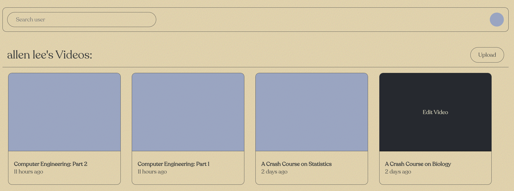
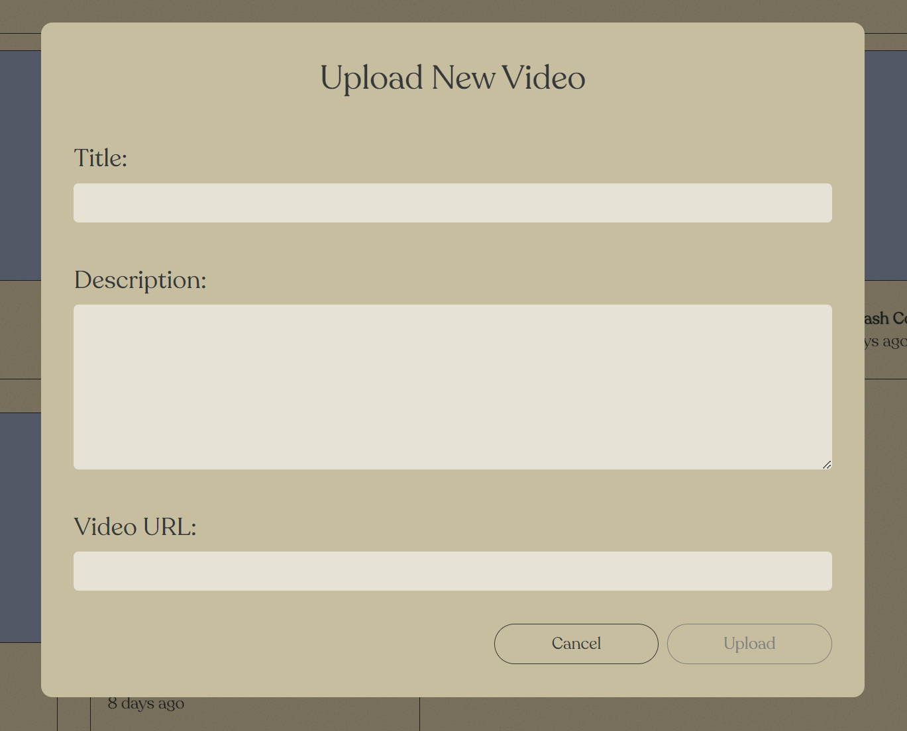
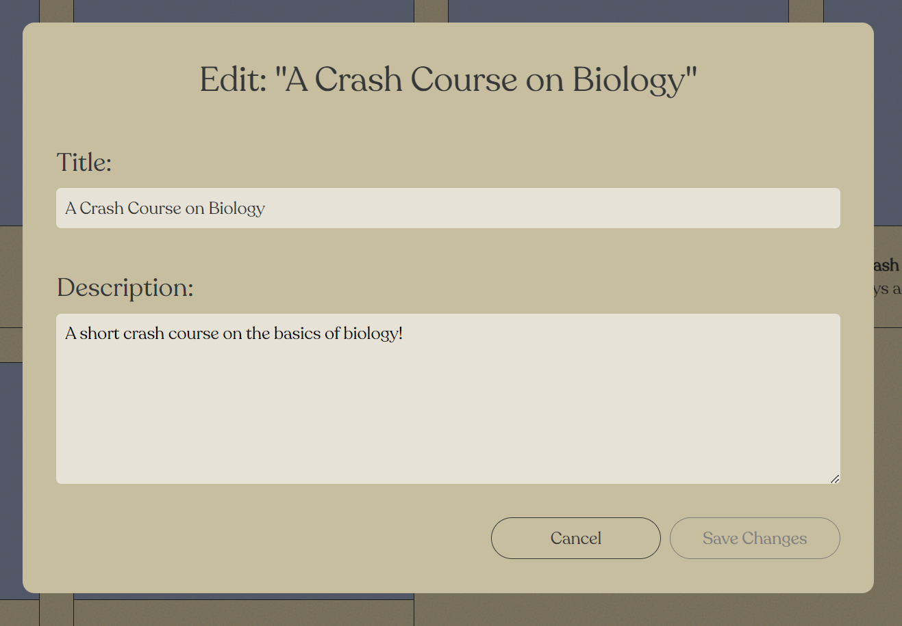
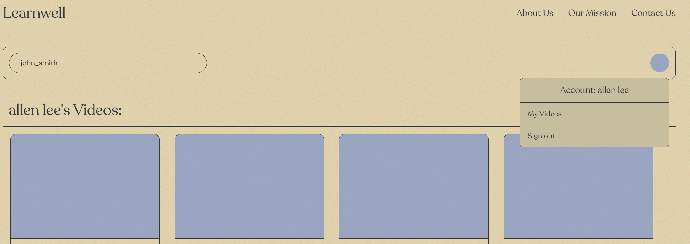

# Learnwell: Educational Video Sharing Platform

Learnwell is an online video sharing platform for educational content. Watch videos, post comments, and connect with a learning community.

> This project was created for development practice only.

## How to install and run

Learnwell was developed with Vite. To build and preview the application, complete the following steps:

1) Clone the repository into your directory:
 
   `git clone https://github.com/6207ALS/learnwell.git`

2) Navigate to the cloned repository and install its dependencies using your preferred package manager (i.e `npm install`).

3) Build the application with Vite's build command: `npm run build`.

4) Start the application using `npm run preview`.

5) Navigate to `localhost:4173` on your browser to view the application.

## Solution Overview

#### <ins>Landing Page</ins>
The typical user flow for Learnwell begin at the landing page. The user can choose to learn more about the company or navigate to their personal videos.

  

   
  

#### <ins>Sign In</ins>
If the user clicks "Watch Videos" and is not signed in, they are navigated to `/signin` and prompted to sign in as a user.

  

   
  

> [!NOTE]
> Because the external backend API lacks an account creation service, the login process is simply entering the user's first and last names. Of course, this limits the functionality for the overall application. All users who have the same first and last names will share the same account. These users will post videos, edit videos, and comment all under the same identity. In the real world, the backend would have an account creation service to uniquely identify all users and their personal content. 

#### <ins>Homepage</ins>
Once signed in, the user is navigated to a personal homepage that lists their uploaded videos.

 

> [!NOTE]
> In a typical video sharing platform such as YouTube, users are navigated to a homepage after signing in. The homepage displays a curated list of videos
uploaded by other users. In my solution, the homepage only lists videos
uploaded by the user. The backend API lacks the endpoints to retrieve
other users, limiting what type of content the homepage could display. 

#### <ins>Upload Video</ins>
Users can click the "Upload" button to post a video, which opens a modal for the video's details

 

> [!NOTE]
> Video URLs must be a direct video link, not an embed link. For testing purposes, you can use the following free, publicly hosted links to upload example videos: ([Source](https://gist.github.com/jsturgis/3b19447b304616f18657?permalink_comment_id=3658531))

  - http://commondatastorage.googleapis.com/gtv-videos-bucket/sample/ForBiggerFun.mp4

  - http://commondatastorage.googleapis.com/gtv-videos-bucket/sample/TearsOfSteel.mp4

 

#### <ins>Edit Video</ins>
Users can hover over a video and click "Edit Video" to edit a video's title/description. Inputs are pre-populated with the video's details.

 

#### <ins>Headers (Public and Private)</ins>
All routes in Learnwell display a Header component for informational pages (`About Us`, `Our Mission`, and `Contact Us`). Signed-in users additionally have access to a secondary header: 

 

 - Users can navigate to another user's personal homepage by entering their `user_id` (`first_last`) in the search bar.
 - On the right, users can click on their profile icon to view their personal videos or sign out.

#### <ins>Video Page</ins>

Clicking a video card in the homepage navigates the user to the video itself. The structure of the page is similar to sites such as YouTube or Vimeo - a video player followed by details about the video. 

 

 - When the user's mouse hovers the video, the media controls appears.
 - Media controls include:
	- Navigating to a specific time (by clicking on the progress bar)
	- Playing/pausing video
	- Volume control
	- Playback speed
	- Entering/exiting fullscreen mode

#### <ins>Comments</ins>

Below the video player is a comment form and a list of comments posted by other users.

 

## Tools/Libraries
- TypeScript
- React.js (`useContext`, `useReducer`)
- Framer Motion (animations)
- React Router (`Router`, `Route`, `useNavigate`, `useLocation`)
- Figma & CSS 

## Future Improvements

#### <ins> Responsive Layout </ins>
The application is responsive to some degree, but can be improved. For instance, the application is not optimized for mobile devices. Additional media queries and proper CSS units can be used to make Learnwell a more responsive application. 

#### <ins> Further Componentization </ins>
Most of the application's components have have been abstracted away into sub-components. However, components with complex state management such as the media controls remain as large single components. 

#### <ins>Testing</ins>
The application should ideally have some tests to improve  maintainability. Tools such as `React Testing Library`, `Vitest`, or `Jest` can be used.
